# 1. Simulation

Before running simulations, ensure the following environment is ready:

- Python and PyTorch have been installed.

- Vivado version is 2021.2.

## 1.1 Generating Test Vectors and Yref,f

First, navigate to the working directory:

Set-Location \"\...\\acc\\data\"

Then generate test matrices:

python .\\generate_X_test_tensor_bf16.py \# Generate matrix X

If the following output appears, the generation is successful:

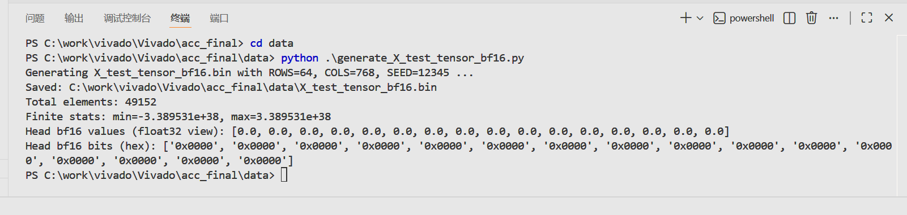

Continue with:

python .\\generate_Y_test_tensor_bf16.py \# Generate matrix Y

python .\\generate_golden_outputs.py \# Generate Yref,f

When the output shown below appears, the process is successful:

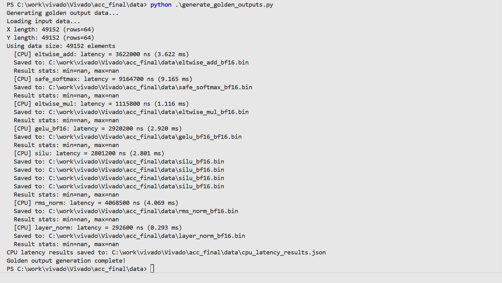

After this step, seven .bin files will appear in the directory.\
These files are the reference outputs of the seven functions generated
by Python.

A file named cpu_latency_results will also be generated, logging the CPU
execution time for each function.

## 1.2 Vivado Simulation

Important:\
[Before simulation, update the testbench file paths.]{.mark}\
Softmax, LayerNorm, RMSNorm, SiLU, and GELU require *four* path
updates;\
Elementwise Add (el_add) and Elementwise Multiply (el_mul) require
*three* updates.

Failure to update file paths will result in file-read errors and
simulation failure.

Example: Softmax Simulation

a\. In Vivado, set test_softmax_top as the top module:

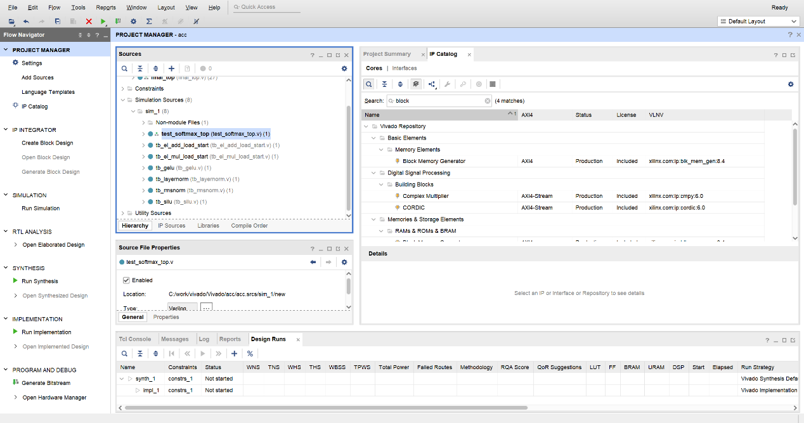

b\. Run the simulation:

Compilation may take 4--5 minutes.\
After compilation completes, click Run All and wait for the simulation
to finish.

If the window displays the following information, the simulation is
successful.\
The value DUT count represents the number of computation cycles counted
by the internal timer.

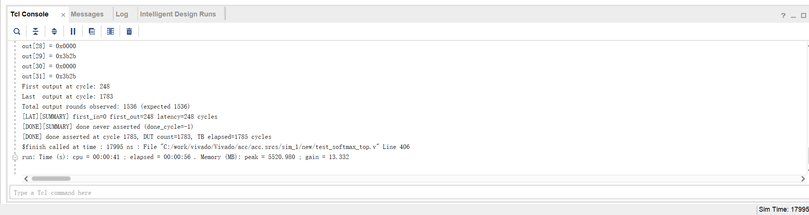

c\. After the simulation completes, a file named:

softmax_out_tb.bin

will appear in the data directory.\
This file contains the bf16 simulation result.

Repeat this procedure for other functions by changing the top module.

## 1.3 Error Calculation

To compare the Python-generated results with the simulation outputs:

Set-Location \"\...\\acc\\data\"

python .\\compare_softmax_bins.py

If the following output appears, the comparison is successful:

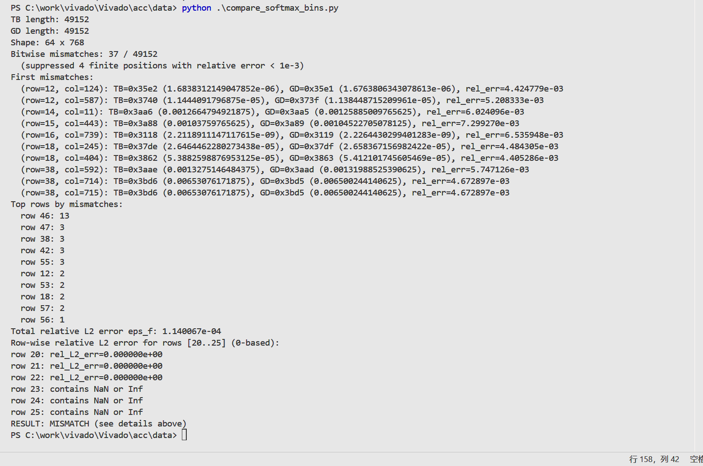

Explanation of Output

- "mismatch" does not indicate an error.\
  Each matrix element is compared against its reference:

  - Relative error \< 1e-3 → considered a *match*

  - Relative error ≥ 1e-3 → considered *not matching*

- Final error statistics example: Total relative L2 error eps_f:
  1.140067e-04

The tool also prints key rows that require special evaluation\
(e.g., rows 20--25 for Softmax):

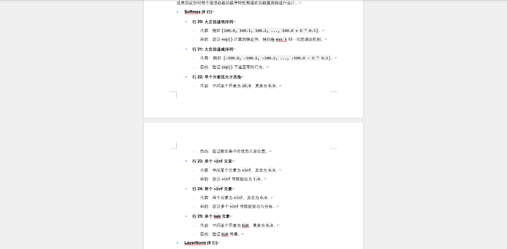

# 2. Synthesis

Note:\
This synthesis process does not include Zynq;\
its purpose is purely to evaluate maximum frequency and resource
utilization.

Set top_test as the top module and run synthesis.\
Since synthesis takes a long time, the following shows the pre-generated
results:

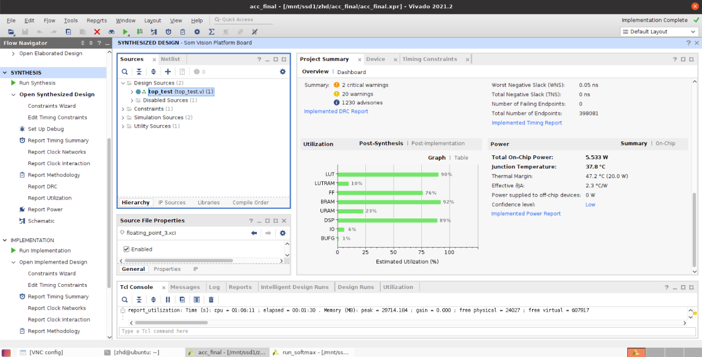

Then set the clock period as follows:

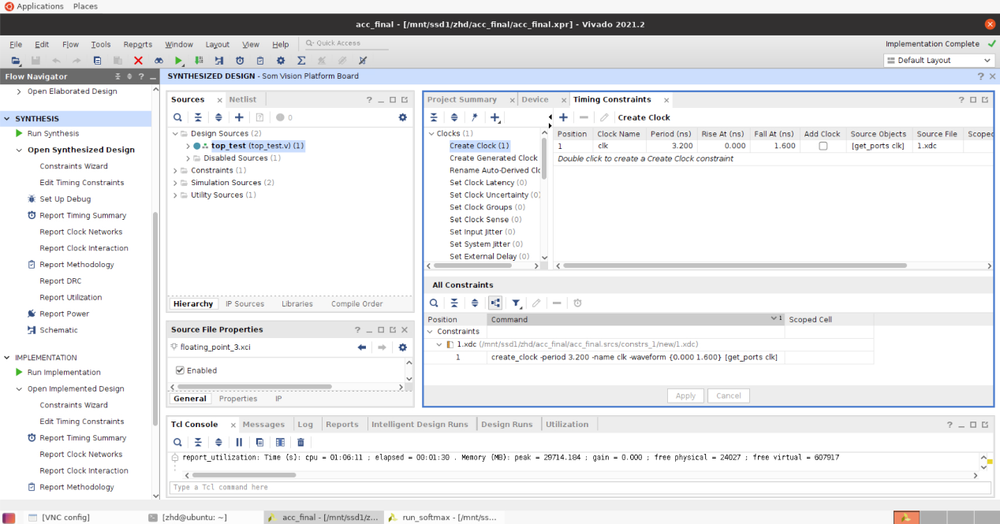

Proceed with Implementation, resulting in:

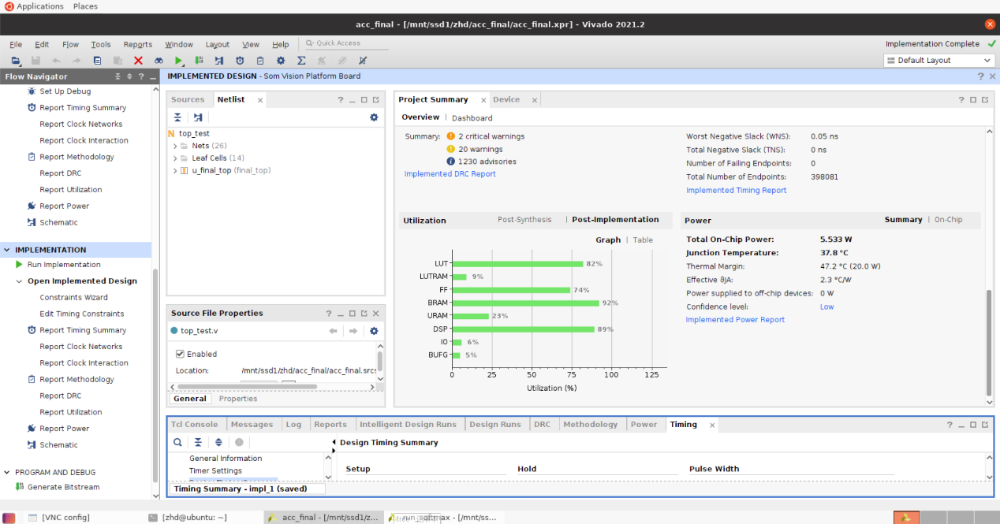

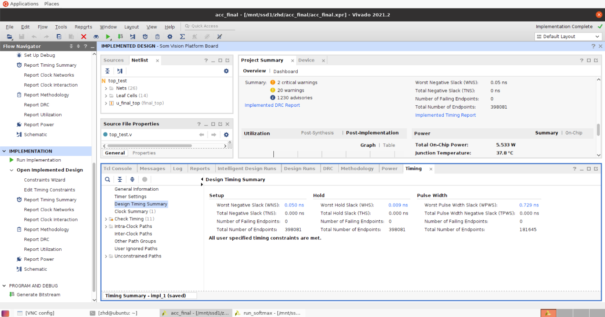

# 3. **Board Testing**

Note that the top-level file at this stage is axi_final_top, and the
board model is VCU118.

## 3.1 **SOC Setup**

We use the MicroBlaze soft processor to send instructions to the
activation function computation module via the AXI bus, controlling the
type of activation function and initiating the computation. The
computation module is connected to the performance counter via the start
and done interfaces to count the number of computation cycles, and the
results are printed through the UART serial port.\
The overall SOC setup is shown in the figure below:

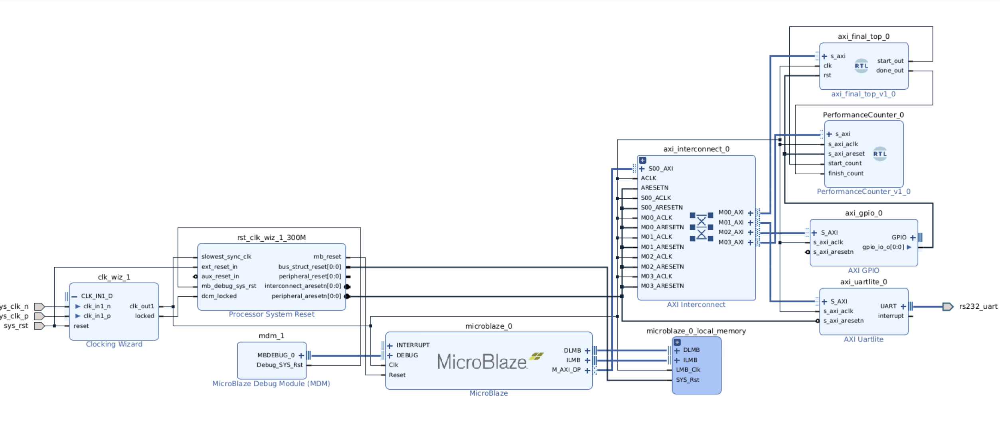

## 3.2 **Synthesis**

The synthesis results are as follows:\
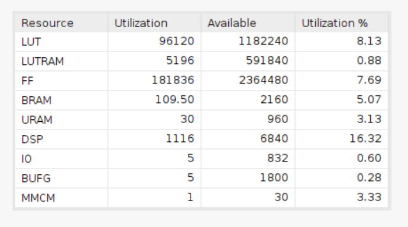

## 3.3 **Vitis Platform Setup**

The Vitis platform is set up using the XSA file exported from Vivado.\
After debugging, we checked the data at address 0xA0000000 and compared
it with the simulation results, finding them to be consistent.
